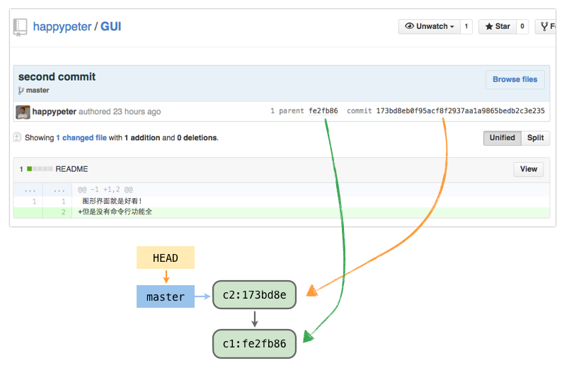
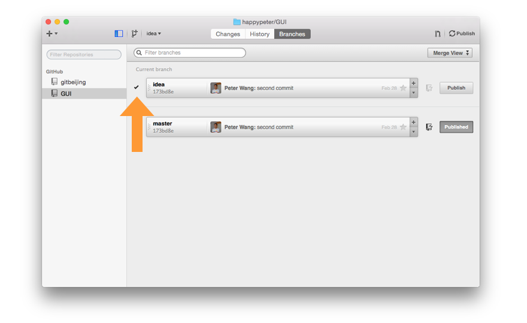
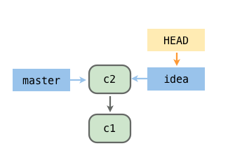

今天的主角是分支，因为不介绍分支 branch 的概念，下面的操作是没办法介绍了。

### 什么是分支。
默认仓库创建的时候就是一个分支，名字叫 master，但是用户可以自己创建其他的分支的。

其实 master 就只是一个指针，但是 git 怎么通过一个指针就确定一个分支的呢？这个就要说到上图中的 parent 这个概念，因为一个 commit 有它 parent，也就是能找到他的上次 commit，这样只要把 master 指向最新的一个 commit 这个分支就能确定了。另外默认还会创建一个挺看重挺傻的指针叫做 HEAD，它指向 master 本身。稍后咱们一起创建一个新的分支，就知道 HEAD 其实妙不可言。

想象一下历史线上又很多节，每一节就是一次再版，好像一根竹子。 一个分支相当于一跟竹子，一节节的往上长。每个版本就是一节。

### 创建新分支

跟 master 一样，新创建的分支也只是一个指针。比如运行

    cd GUI
    git checkout -b idea

就创建了一个名字叫 idea 的指针。到 Github for Mac 客户端里看一下，发现确实多了一个分支。

上图箭头中的小对号表示当前已经切换到了 idea 这个分支之上，那 idea 就叫做当前分支。 达成的效果如下图：

这时候如果运行

    git branch

就会看到当前分支已经是 idea 了。因为 idea 和 master 都指向相同的地方，所以此刻，这两个分支是相同的。有意思的是，如果新建分支上面继续做开发，新添加一个 commit，就是下面这样的情况

注意这个时候 master 分支是没有动的。要想切换回 master 分支

    git checkout master

这样，HEAD 指针就又指向了 master 。

HEAD 永远指向当前分支的最新的版本。
<!-- stash 的报错情况很不好描述，用到得又不是挺多，所以偷懒不讲了 -->

删除分支就要

   git branch -D idea

注意，被删除的分支不能是当前分支。

### 实际操作演示

前面把道理都说了，下面动手来做一下。新建一个仓库

    mkdir cool
    cd cool
    git init

然后创建一个文件叫 index.html 里面写一行内容：

    AAA

保存这个文件，然后做出 master 上的第一个版本

    git ci 

然后输入版本留言 "first commit" 。接下来切换到一个 idea 分支上开展一个新想法

    git checkoout -b idea

把 index.html 中的内容改为

    AAA
    BBB

再来运行 `git ci` 版本留言为 "new idea"，这样就可以切换到 master 上来 merge 这个新想法的代码了。

<!-- 录视频的时候可以用 scoot schcon 演讲时候用的那个 html 的例子 -->

### 总结

只开测试分支，调好代码 commit 了之后，如果不把代码搞到 master 分支上是没有太大意义的，这就涉及到分支合并的问题了，这个是 git 最大最强的一块功能，后面再介绍。