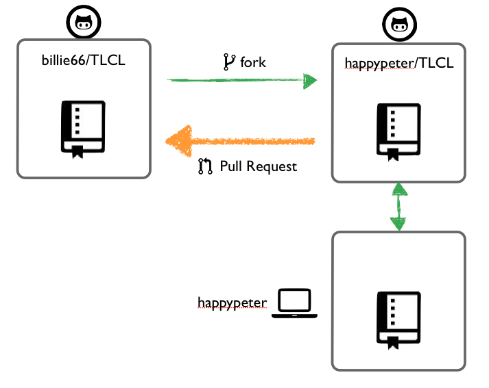

Github 是个 Social Coding 的平台，Social Coding 社交化编程，很有意思。
<!-- https://guides.github.com/activities/contributing-to-open-source/ -->

跟自己团队的项目不同，网上的开源项目参与者众多。如果你一上去就跟项目拥有着说，Hey，你给我加个写权限吧 ...

<!-- happycasts 60 详细图解了 fork 的流程 -->

这样 billie66 就会看到 happypeter 发的 Pull Request，然后决定是否要把 happypeter 写的代码 merge 进自己的仓库。

下面来实际操作一下，对应上面图示的过程，比如现在我想要贡献 TLCL 这个项目，同时假设我 happypeter 不是这个项目的 collabrator 。

我可以来到项目的页面上，点击 fork 按钮。

fork 结束之后就可以看到在我的用户名下，多了 TLCL 这个项目。所以我可以来 clone 这个项目了。

这样我可以修改然后 commit 然后把这个 commit push 到我自己的那个 fork 上了。

这样如果 billie66 merge 了 happypeter 的 pull request 最终版本历史就如下图所示

一个 pull request 发出之后，如果大家查看之后认为我的代码还需要调整，这样，我可以继续向同一个 PR 上面 push 代码的，所以在 github 的这个 PR 的页面，就形成一条非常清晰的讨论主线。

一个 pull request 完成之后，随着时间的推移上游的仓库中会有新的 commit 进来，所以我自己的这个 fork 就需要更新了。我自己通常的做法是不更新，直接删除掉，未来需要再贡献的时候重新 fork 一份。但是如果你对这个项目发 Pull Request 比较频繁，还是学会更新 fork 更为方便一些，这个可以参考 [codeschool 的这个视频](http://campus.codeschool.com/courses/mastering-github/level/1/section/4/video/1) 。


$ git remote add upstream git@github.com:billie66/TLCL.git 
 

更好的，你可以参与到其他人的代码之中。参与讨论就是到 github issues ，但是如果要贡献代码就要用到  Pull Request，这两个功能后面都会有专门的章节来介绍。

http://happycasts.net/episodes/58 network 可以提一下

### 贡献是参与的最高形式

可以写代码也可以写文档

   - pull-rebase http://happycasts.net/episodes/10
     - 这个是开发中随时都会出现的内容，所以肯定要讲
     - git pull --rebase 解决 rejected 的问题

https://github.com/blog/1946-create-pull-requests-with-github-for-mac
https://github.com/blog/1945-quick-pull-requests
https://github.com/blog/1905-linking-merged-pull-requests-from-commits
https://github.com/blog/1943-how-to-write-the-perfect-pull-request
https://guides.github.com/activities/forking/

https://guides.github.com/activities/hello-world/

https://guides.github.com/introduction/flow/

如果是自己人，可以考虑直接加这个人做 collabrator 这样这个人就可以直接向项目中 push 代码了，就不用 PR 了。

现在在浏览器中，新建删除编辑文件都很方便，而且可以新建 branch 可以说 web 界面对于 Pull Request 的支持已经是很严肃了。
[参考](https://github.com/blog/1557-github-flow-in-the-browser) 。

github 对 UI 的简约是有极为苛刻的要求的，所以很多功能是隐藏的， [参考](http://zachholman.com/talk/git-github-secrets/) 。
网页界面这里也能给别人的项目进行贡献，这个是通过 Pull Request 来实现的，这个后面要细聊，这里先过了。

更多内容可以参考 <http://git-scm.com/book/en/v2/GitHub-Contributing-to-a-Project> 。

如何在浏览器中使用 github 的说明，<https://github.com/blog/1557-github-flow-in-the-browser>

说说宏观思路。我现在有一个项目，你想来贡献一些补丁进来，如果咱俩跟本就不认识，你直接给我来信，说 Peter 你把我加成项目的 collabrator 吧？那结果可想而知。
但是如果，你不写信，而是先把要改的东西改好，patch 给我发过来，这样我作为项目维护者必然觉得你这个人很靠谱，愿意跟你讨论，而且很有可能会把你的 patch 融合到项目中的。这个基本上就是 github 上最为常见的，用 PR 的形式来贡献代码。

https://help.github.com 第三步

这个属于高级内容了，要放到所有的基础讲完之后讲

- http://happycasts.net/episodes/60
  - 图示整个过程

- http://happycasts.net/episodes/37
  - 实际 fork 的流程

- 要不要提一下代码冲突的问题
  - 也可以到 merge 和 rebase 相应的章节中展示一下代码冲突发生后如何处理

- 发 pr 之前做一下 git pull --rebase 是很好的

