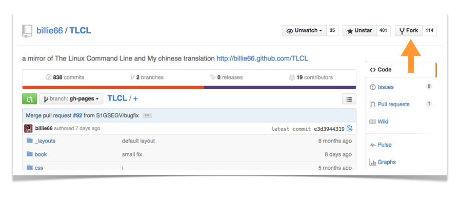
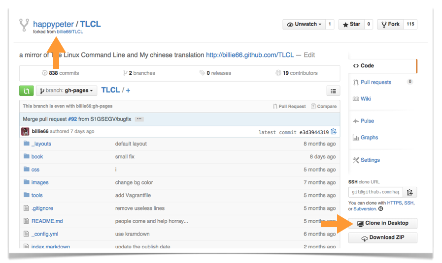
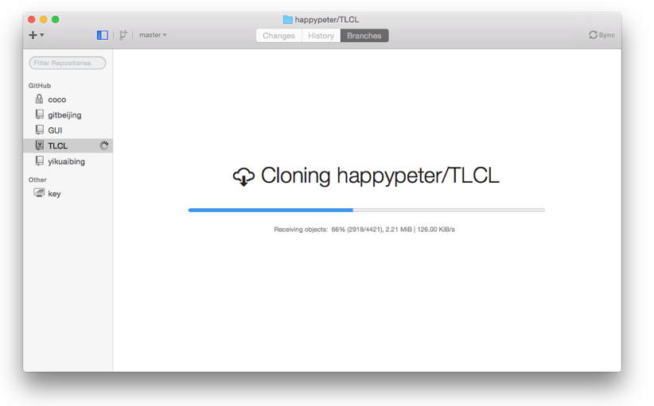
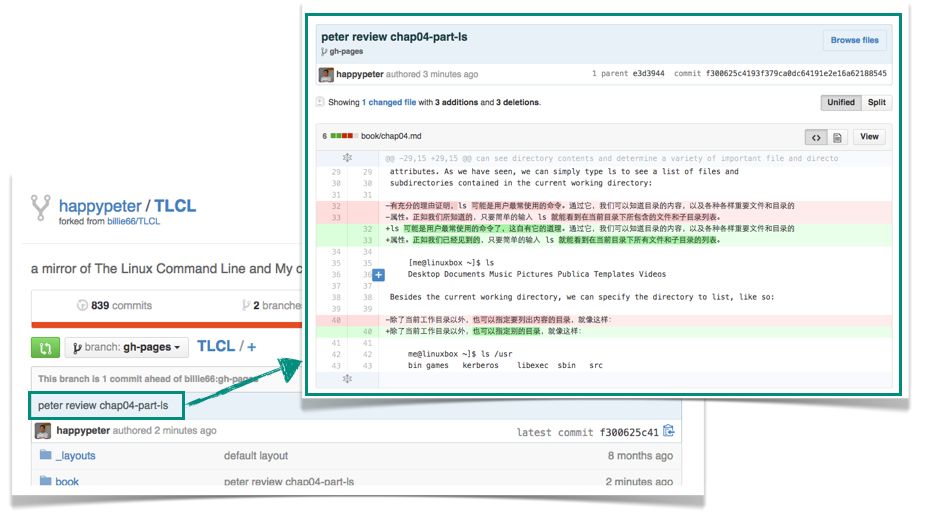
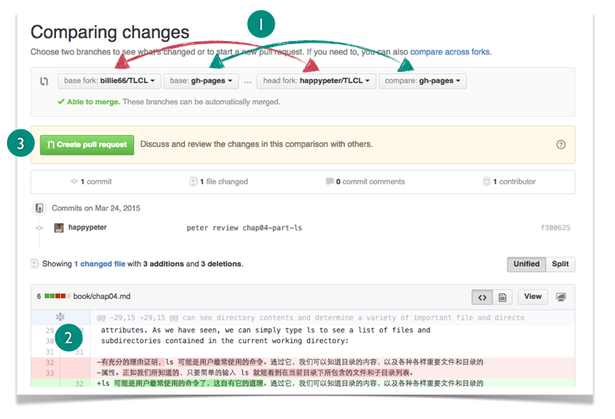
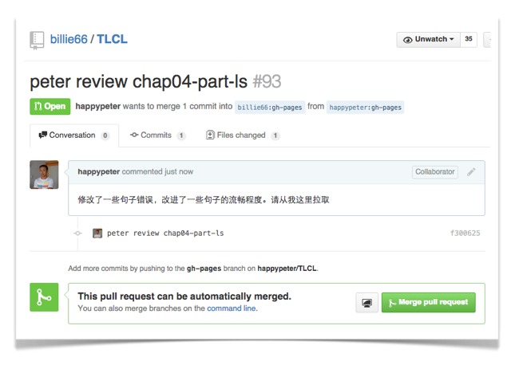

Github 是目前世界上最大的开源项目的托管交流平台。[贡献开源项目](https://guides.github.com/activities/contributing-to-open-source/)的流程也是 Github 全力支持的，也一样是遵循 Github Flow，虽然跟前面团队合作流程会有一点差别。在团队内部，大家都是有写权限的。但是网上的开源项目参与者众多。如果你一上去就跟项目的拥有者说，Hey，你给我加个写权限吧，别逗了，人家也不认识你，怎么可能呢？

### Fork

所以第一步是 Fork 这个项目。所谓我 fork 别人的一个项目，就是指做一个把这个项目做一个拷贝，放到我自己的账户下。

现根据上面的图说说基本思路。第一步，先 fork，这样我就有了 happypeter/TLCL 这个项目了，那既然是我自己的项目，我就可以把它 clone 到我本地，做修改，然后推送到 github 上的我自己的那个 fork 之中。这样上游的仓库，也就是 billie66 名下的仓库，就可以跟我自己 fork 的这个仓库来进行对比，发出 Pull Request 了。

下面来实际操作。

来到 TLCL 的项目主页，也就是 <https://github.com/billie66/TLCL> 。点右上角的 fork 按钮。

这样，我自己的名下就多了一个 TLCL 项目，这个项目就叫做原有项目的一个 fork 。

到这里 fork 这一步就结束了。那对于 happypeter/TLCL 这个仓库，我当然有修改的权限了，可以在网页上修改直接发 PR。也可以 clone 到我本地客户端中，在本地作修改。下面就可以点右下角的 `Clone In Desktop` 按钮，来把项目 clone 到本地了。

### 做版本和同步

对照团队合作的 [Github Flow](http://gitbeijing.com/flow/)，这里主要的区别是没有开新分支，而是创建了一个新的 fork。这样，billie66/TLCL 中代码是在 gh-pages 分支上，那现在我在本地修改，新版本放在 happypeter/TLCL 的 gh-pages 上就可以了。

用自己喜欢的编辑器做出修改，做 commit，然后同步到远端的 happypeter/TLCL 中，这些步骤到现在应该是轻车熟路，小菜一碟了。于是到 github.com 可以看到下图的内容

如上图所示到 happypeter/TLCL 的仓库主页，可以看到最新的我做的版本的留言，点开就可以看到我这次修改的内容了。现在可以来发 PR 了。

### 发 PR 和代码审核

发 PR 的过程跟前面介绍过的没有本质区别。

如下图，点一下项目页面右侧的 `Pull Request` 链接，到达的页面中会有一个大大的绿按钮 `New Pull Request`，点一下就看到下面的页面

注意上面1处，要选对是哪两个分支进行对比，左侧应该是上游分支，右侧是你自己的分支。有时候 github 能猜对，有时候就要自己手动选择一下分支，分支要是选得不对那么2处对比出来的代码肯定也会有问题的，所以还是比较容易看出来的。下面就可以点2处的大按钮来发 PR 了。

上面的界面中填入一些留言，点 `Create pull request` 按钮。这样在 billie66/TLCL 下面，注意不是 happypeter/TLCL 下面，就会多一个 PR 了。 

这样 billie66 就会看到 happypeter 发的 Pull Request，就可以来跟我讨论。如果决定要把我的代码 merge 进自己的仓库，点一下 `Merge Pull Request` 按钮就可以了。

这样，我这次贡献代码的工作就结束了。TLCL 的版本历史中会永远留下 happypeter 的名字。同时我发的这个 PR 关掉之后，也可以在 billie66/TLCL 的 Pull Requests 一项下面被永久保存，所以我可以放心的删除我自己的那个 fork 了。

### 后续工作

删除一个 fork ，跟删除一个我自己的项目仓库是一样的。

如上图，点开 settings ...

一个 pull request 完成之后，随着时间的推移上游的仓库中会有新的 commit 进来，所以我自己的这个 fork 就需要更新了。我自己通常的做法是不更新，直接删除掉，未来需要再贡献的时候重新 fork 一份。但是如果你对这个项目发 Pull Request 比较频繁，还是学会更新 fork 更为方便一些，这个可以参考 [codeschool 的这个视频](http://campus.codeschool.com/courses/mastering-github/level/1/section/4/video/1) 。

http://happycasts.net/episodes/58 network 可以提一下

### 基于 fork 的快速 PR

前面介绍过[快速 PR]()了，不过是基于一个我自己有写权限的项目。那对于人家的开源项目，我根本就不能修改，能不用在网页上直接发开速 PR 呢？幸运的是，答案是肯定的。

现在我来的 @bille66 的这个项目，打开一个我想要编辑的文件，注意，现在打开的不是我自己那个 fork 。

<!--  - http://happycasts.net/episodes/60
  - 图示整个过程 
改进这期 视频 可以做一套更简单点的，符合本章内容的图示
更简单，更美观是我未来的一个方向了

  -->
