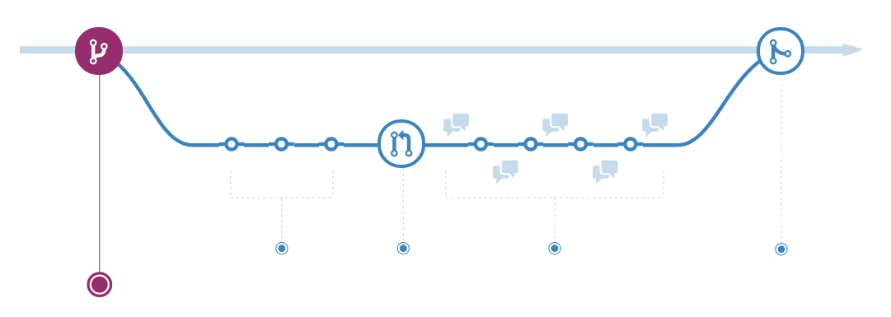
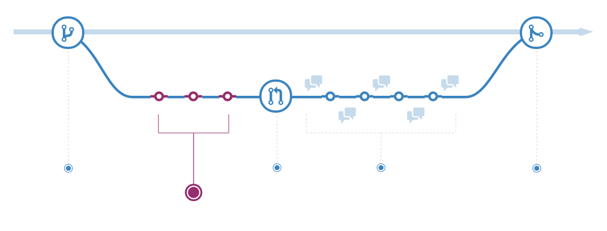
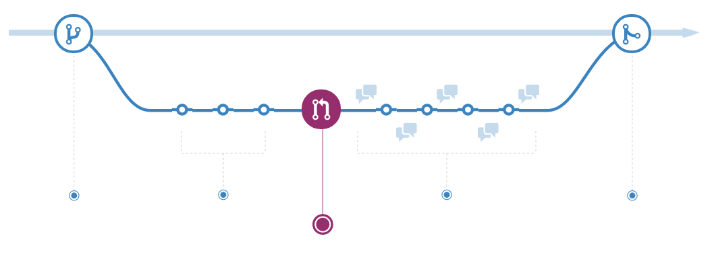
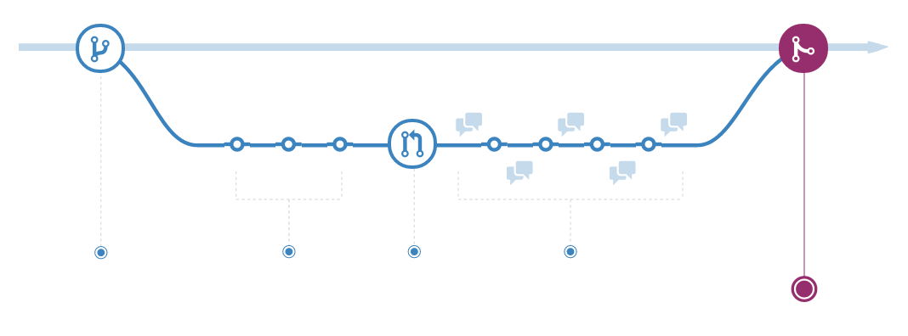

前几天还都是自己唱独角戏。但是尽管如此也可以看出 git 带来的便利了。但是 git 更大的威力在于协作。
<!-- 写到目前，读者还只能感受到 git 带来的麻烦，感受不到 git 带来的便利，所以单兵作战的部分还要给大家梳理一下，用了 git 到底有哪些好处，不然，如果我不是跟团队开发，那么是否就没有必要学 git 了
- 代码回滚，这样就写错了就不怕了
- 开心分支开发，master 上的代码不会被影响，这样就不用 file-v1.md file-peter.md file-billie.md 这些弱智的备份方法了
- check happycasts git workflow for more
 -->

前面的所有技巧，都为今天咱们一起使用这套 Github Flow ，Github 公司推荐的团队合作流程，打基础。实际情况是这样，git 本身是非常灵活的，可以在 git 的基本功能之上实现各种不同的工作流程。Github.com 就是按照自己特有的一套工作流程为思路建立起的网站，整个这套流程的核心就是“拉取请求”（ Pull Request ），后面简称 PR 吧。

用 git 和他人协作开发项目有多种形式。就像 Progit 书中[列出的]。今天来聊 [github 公司的流程](https://guides.github.com/introduction/flow/index.html)。就是同一个仓库中，大家都有写权限的流程。这个流程显然是自己的团队，自己的项目。

### 什么是 Github Flow ？

创建新的话题分支。

不断实现功能，做成一个个新版本。

发起 PR 。

大家讨论。

把话题分支的内容合并到 master 。

这些图都是我从[官方的 Github Flow 页面](https://guides.github.com/introduction/flow/index.html) 摘下来的，我们还整个的翻译了这个页面，放在了[这里](http://gitbeijing.com/flow) 。流程的细节你可以到这个页面上去看。下面主要跑一个实际例子。

<!-- http://git-scm.com/book/en/v2/GitHub-Contributing-to-a-Project 的例子就挺好 -->

### 给队友添加写权限

用 collaborator 

添加完 collaborator 之后，我的队友也有对这个仓库的写权限了。

### 网页上发 PR

<!-- 
如何在网页上直接 edit 并发出 PR
https://github.com/blog/1945-quick-pull-requests

这个方法是最简单的实现 github flow 的操作流程
 -->

<!-- https://guides.github.com/activities/hello-world/ -->

<!--  PR 定义

- 可以让队友审核你的代码
- 可以讨论，跟一个 issue 一样

Pull requests are proposed changes to a repository submitted by a user and accepted or rejected by a repository's collaborators. Like issues, pull requests each have their own discussion forum. See Using Pull Requests.

https://help.github.com/articles/github-glossary/
 -->

一个 pull request 发出之后，如果大家查看之后认为我的代码还需要调整，这样，我可以继续向同一个 PR 上面 push 代码的，所以在 github 的这个 PR 的页面，就形成一条非常清晰的讨论主线。

每一个 PR 都是开发历史上的一次小事件，很长事件过去之后，再看看当时的 PR 就可以看到当时为什么要开发这个功能，大家都是什么意见，都写了哪些代码。所以是项目发展的珍贵资料。

### 客户端中发 PR

尽管网页中发 PR 很方便，但大部分时候可能要修改的内容比较多，所以还是本地用自己喜欢的编辑器来干活比较快，而且很多代码还要测试一下的。所以大部分时候还是会在本地写代码，写完了之后，可以用[客户端来发 PR](https://github.com/blog/1946-create-pull-requests-with-github-for-mac)。

现在在浏览器中，新建删除编辑文件都很方便，而且可以新建 branch 可以说 web 界面对于 Pull Request 的支持已经是很严肃了。
[参考](https://github.com/blog/1557-github-flow-in-the-browser) 。

更多内容可以参考 <http://git-scm.com/book/en/v2/GitHub-Contributing-to-a-Project> 。
