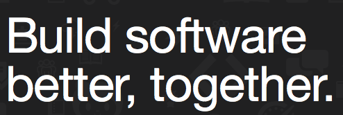
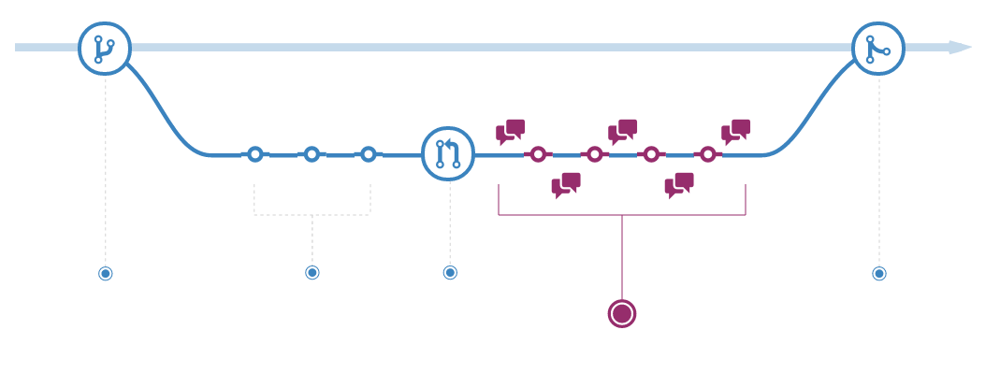
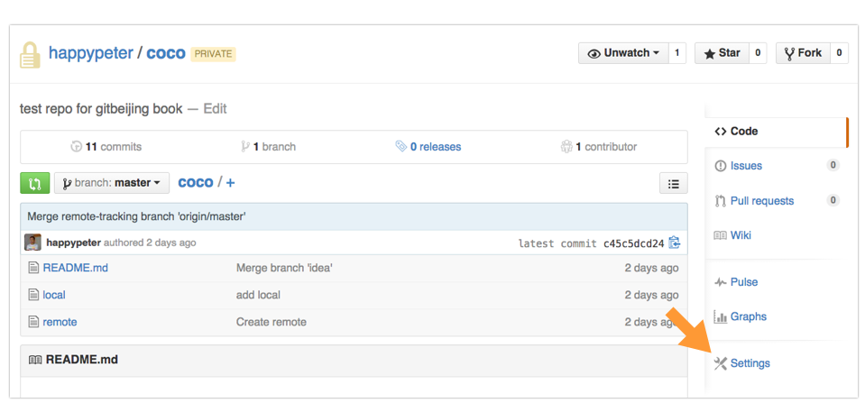
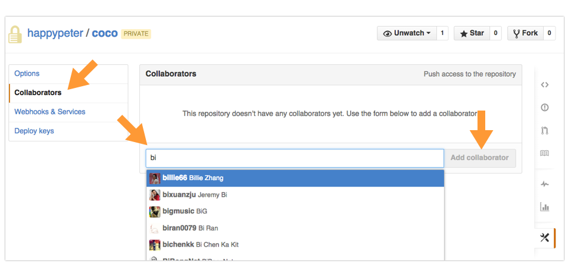

前几天还都是一个开发者唱独角戏。但是尽管如此也可以看出 git 带来的便利了，比如代码写错了可以回滚，新功能开发可以开新分支等等。但是 git 更大的威力在于协作。

聊了这门多天的 github，有必要稍微停下来，再想想究竟什么是 github 。没错，前面的使用中也看到了，github 是 github 的托管平台，让我们的项目可以方便的备份同步和做版本控制。但是其实也许比这个还要重要的是，github 是一个大家一起协作做项目的平台。

就像 github 的创始人 Chris 在演讲中提到的。

>It's not about git

在 How Github Use Github To Build Github 的演讲中，Zach Holman 说，

>多年来我一直在寻找什么样的方式做软件才是正确的方式，现在我想我找到了，github 就是这种方式。

究竟 Github 是什么的问题从它的标语中也可以看出，早期是“Git Hosting No Longer Pain In The Ass"，可见最早 Github 的目标确实是想成为一个好的代码托管平台。但是现在首页的标语却是

所以说，Github 最核心的点，是要实现一套软件开发的协作流程。Git 是一个分布式的版本控制工具，所以可以在它的基础上实现各种工作流程。Github 多年来总结出来一套自己的团队协作流程，简单而且强大，叫做[github Flow](https://guides.github.com/introduction/flow/index.html) 。

要了解一个流程，没有什么比跑一个最简单的实际例子更好的方式了，官方给出的[Hello World](https://guides.github.com/activities/hello-world/)就是服务于这个目的，不过这个 Hello World 用的是纯粹的网页来实现整个流程。咱们今天用网页配合 Github For Mac 客户端来完成这个流程。

### 什么是 Github Flow ？

创建新的话题分支。

不断实现功能，做成一个个新版本。

发起 PR 。

大家讨论。

把话题分支的内容合并到 master 。

这些图都是我从[官方的 Github Flow 指南](https://guides.github.com/introduction/flow/index.html) 摘下来的，我和 [@billie66](http://github.com/billie66) 还整个的翻译了这个指南，放在了[这里](http://gitbeijing.com/flow) 。流程的细节你可以到这个页面上去看。下面主要跑一个实际例子。

<!-- http://git-scm.com/book/en/v2/GitHub-Contributing-to-a-Project 的例子就挺好 -->

### 给队友添加写权限

现在我和 @billi66 要合作开发一个新项目。于是我就来创建这个项目，过程在[浏览器中使用 Github](github_in_browser.html)中已经介绍过了。下面就继续在 coco 这个项目上做演示。

现在我要把 @billi66 添加进来，让她也具有项目的各种操作权限，最终要的当然是修改的权限了。如何来做呢？把她添加成项目的 collaborator 就行了。 coco 本身是一个 Private Repo ，但是对于开源项目也是一样可以添加 collaborator 的。

<!-- 未来跟 scoot 一样，用一个开源的项目放在那里，大家看看，挺好 -->

首先到项目页面，点击 Settings 一项，

到项目的 Settings 页面，可以看到如下图所示的 collaborator 选项，输入框中输入 `bi` 就可以自动补齐出 `billie66` 了

回车选中，然后点 `Add collaborator` 按钮，这样就完成了。

### 开话题分支并在上面开发

现在我和 @billie66 都对 coco 项目有写权限，对于非常有把握的代码，可以直接在本地 master 开发然后 sync 到远端 master 分支上面。但是如果是比较重要的功能，还是要发单独开 Topic Branch 话题分支，这个是后面发 PR 的前提。

尽管所有的流程操作都可以在[浏览器中完成](https://github.com/blog/1557-github-flow-in-the-browser)。但是更为常见的情形是我和 @billie 会把代码 clone 到本地开进行新功能的开发，因为这样可以使用自己的编辑器以及测试工具。

### 发 Pull Request

PR 在整个流程中起着核心位置。

其实发 PR 的目的就是引发讨论，跟一般的讨论不同的地方在于整个讨论过程是围绕着实打实的代码。

<!-- 先说最正常的流程，然后再告诉大家，如果你只是改一个文件中的一个小地方，完全可以使用  https://github.com/blog/1945-quick-pull-requests

说实话，即使是老手，你让我切换到命令行，再跑一遍整个的这个发 PR 的流程，我也会觉得挺麻烦挺分心的。
-->

### 讨论审核代码

PR 的讨论过程也算是代码审核。不一定是一个老大审核小弟们的代码，可以是队友之间的互相审核。

好，上面咱们也看到了什么是 PR 了， 一个 pull request 发出之后，如果大家查看之后认为我的代码还需要调整，这样，我可以继续向同一个 PR 上面 push 代码的，所以在 github 的这个 PR 的页面，就形成一条非常清晰的讨论主线。

每一个 PR 都是开发历史上的一次小事件，很长事件过去之后，再看看当时的 PR 就可以看到当时为什么要开发这个功能，大家都是什么意见，都写了哪些代码。所以是项目发展的珍贵资料。

实际上，[客户端中也可以发 PR](https://github.com/blog/1946-create-pull-requests-with-github-for-mac)，达成的效果跟网页中发是一样的。

### 总结
更多内容可以参考 <http://git-scm.com/book/en/v2/GitHub-Contributing-to-a-Project> 。
