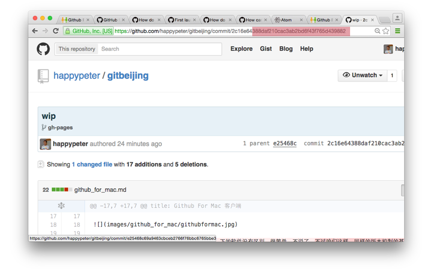

没有安装 git 并不妨碍我使用 github 的基本功能，同样，即使我不联网，也可以在本地进行 git 的版本控制操作。
本课来把前面在 github 上实现的那些版本控制操作在本地重新来一遍。会有很多新的秘密浮出水面。虽然是本地操作，依然不需要自己安装 git，今天的主角是 Github 公司制作的客户端，我下面用 Mac 版的演示，但是 Windows 客户端，[Github for Windows](https://windows.github.com/)，的操作也是类似的。

### 登录

先说说什么是 git 。git 是一套命令行工具，有下面这些“子命令”组成。

虽然最常用的只不过是其中很小的一部分，但是要学会命令行中使用 git 还是有一定难度的，所以命令行操作咱们往后放一放。今天一起来用图形化的客户端工具 [Github for Mac](https://mac.github.com/index.html)，它里面封装了 git，操作上更为美观。

这样可以掌握 git 的最核心的操作，满足基本日常使用也就够了。

和 Github For Mac 客户端的安装跟其他 Mac 下的软件没有区别，很简单，不说了。启动之后要做的第一步就是用 Github.com 上我的账号来登录客户端。这样可以导入各种我在 github.com 上的身份信息。

### 添加仓库

往 Github For Mac 客户端，后面简称客户端吧，里面添加仓库有三种方式。点击上图箭头所指的 `+` 号，就可以看到了，也就是下面图中的 `Add`，`Create`，`Clone` 这三种形式。

可以说这三种形式主要是被添加的仓库来源不同。先说第一种 `Add`，来源是你本地机器上已经存在的项目，填写它的文件夹位置，然后点击 `Create&Add Repository`，意思是如果这个项目本身就是一个 git 仓库了，就直接添加进来，如果不是就把它变成一个 git 仓库（其实也就是在项目内创建一个 .git 文件夹，这个回头讲命令行操作的时候再细说）然后再添加进客户端。

第二种，就是选择 create 这一项。顾名思义就是自己新建了。填写项目名，这里就叫 GUI 吧，然后选择项目存放位置，然后 Create Repository 那个按钮点一下，仓库就创建好了。这个操作似曾相识，是吧，只不过这次是在本地机器上创建的。

第三项，就是从 Github.com 上往本地 clone 。前面我已经用自己的 github 账号登陆的客户端了，所这里就会自动导入 github 上我自己的，或者是一些跟我相关的项目进来，选中一个，在本地找一个位置存放起来就好了。这里先存疑一个问题，那就是能不能 clone 别人的仓库呢，其实是可以的。后面会有非常详细的内容讨论如何为他人的项目贡献代码。

<!-- 找了一下 github for mac 不能直接 clone，那就应该是先 fork 后 clone 吧？https://help.github.com/articles/working-with-repositories/ -->

补充一句。要删除一个仓库，就到左侧列表的项目名字上，右击，然后点 `Remove` 就行了。也可以看到 `Open in Atom`，[Atom](https://atom.io/) 是 github 公司开发的开源免费的代码编辑器。

项目有了下面就可以用 Atom 编辑器，或者其他任何你最喜欢的编辑器来修改项目并保存版本了。

### 基本版本控制

先来修改一下项目。创建一个 README 文件吧，里面随便写点内容就行。

GUI 项目中有了 README 文件后，到项目的 `changes` 一项下面，就可以看到：

首先图中1和2两处可以看到目前项目修改了什么内容。同时可以看到1处是可以勾选的，也就是如果我一次修改了多个文件，可以只吧其中的一部分文件勾选上，添加到下一个版本之中。更为细致的，你可以到右侧的显示 patch 的区域，选择一部分内容添加到下个版本中。点击行号，变蓝的内容就被选中了。

版本，在 git 这里叫 commit 。commit 英文的基本意思是执行某个重要的事情，例如 commit suicide，自我了断。但是在 git 这里，做动词讲的时候就是“保存版本”，当名词讲就是版本。

3处要填写的时版本留言，英文叫 commit message 。简要说说为啥要做这次修改，给队友一个交代。下面的大框框里可以写详细的留言，可以不写。最后点击 `Commit to master` 按钮，一个版本就保存好了。master 是默认分支的名字，后面讲分支的时候会细聊。

所以总结起来，从一个 commit 到下一个 commit，也就是从历史上的一个节点到下一个节点，要经历的操作是下面四步：

重复以上四步，再作一个版本出来。这样到客户端的 history 一项下面，就可以看到历史线上已经有两个 commit 了，点开任意一个都可以看到4个w。

你可以会问，本地的 commit 为啥版本号（ commit id ）是7位呢？其实，所有 commit id 没有例外的都是40位，但是真正要用的时候取前几位就行，只要跟其他 commit 区分开就行，图中给出了前7位，已经是非常安全了。即使在一个超大型项目，历史成千上万，版本号冲突的概率也比被雷劈中两次要低很多了。

比如到 github.com 上面，打开一个 commit，把地址栏链接中的版本号删除下图红色覆盖的部分，也一样是不影响显示的。

### 回滚历史

既然历史版本都已经保存了，那么要回到任何一个版本的状态应该也是可以的。比如我刚刚做了一个版本，就发现 patch 写的又问题，不想要这个版本了。可以到 Changes 选项下，页面最低端的 `undo` 标签，一点，这次版本就没了，注意，所有你的修改内容也都会被删除。再到 `history` 标签下，打开任意一个 commit ，都可以到小齿轮中选择 `Revert This Commit` 来放弃里面的修改。不过这次不是删除这个 commit，而是在历史线上再新添加一个 commit，里面的 patch 内容正好和这个 commit 相抵消。

也有时候有这样的需求，比如我为了实现一个功能做了5个小的 commit，后来这个功能不想要了，要一下子删除这5个版本中的所有的修改，这个怎么来做呢？也简单，点开从顶端数的第6个 commit，然后到小齿轮下点 `Roll Back To This Commit`，那么代码状态就会“回滚”到这次 commit 的状态了。也就是有添加了一个新的 commit，其中的修改抵消了最近5个 commit 的内容。

客户端提供的回滚功能很好用，也非常好理解。但是实际中对于历史回滚，我们可能还有更为细致的要求，这个可以后面用命令行的方法来实现。

### 连接 Github

一般情况下，我的每一个项目都是一式两份，一份是一个本地仓库，一份放到 github.com 上，通常叫“远端仓库”，remote repository。这不仅仅能让我感觉到有备份了，晚上可以睡好觉了，同时这两个备份直接也是通气的。下面说说怎么通气？通什么气？

最重要的要互通有无的内容当然是版本了，git 功能虽然多，但是说白了就是来回折腾 commit 。要不怎么叫版本控制工具呢？

对于从 github 上 clone 下来的我自己的项目，默认的通气通道是通的，这个是符合我们的直觉的。下面说说对于咱们自己在本地新建的项目，如何把它放到 github.com 上呢？

来关注客户端界面的右上角，对于从 github.com 上 clone 下来的项目这里是 `sync`，但是对于 github.com 上没有对应远端仓库的本地仓库，这里就是一个 `Publish` 按钮。点一下，填写项目名，对，项目名可以跟本地项目不一样，然后添加一个项目描述，猛戳 `Push Repository` 按钮。你的项目就发布到 github.com 上了。链接也很优美，就是 github.com/username/project 可以把链接分享给朋友，让邀请他们一起参加你的项目。

注意标号2的框里面支出我可以把项目发布为私有项目，这个只对付费用户开放。Publish 项目成功后，到 github.com 自己的 dashboard，看一下右下方的仓库列表

### 同步版本历史

通常我都是在本地机器上，用我自己用得最顺手的编辑器来修改项目，做成一个或者是多个版本，这时候如果把我的这几个新版本推送（ push ）到服务器上面呢？在客户端中，很简单，就是点一下右上角的 `sync` 按钮就好了。

也有的时候，我在 github.com 上浏览我项目的内容，突然发现一个拼写错误，也就顺手在 github.com 上点 `edit` 按钮，直接修改做成版本了，这样就等于 github.com 上的这个仓库比我本地多了新版本了，这时候我也需要吧这个版本拽（ pull ）到我本地机器上。这个操作也是点一下 `sync` 按钮，也就是”同步“按钮。

稍微梳理一下，本地和远端，也就是我自己的笔记本跟 github 服务器上两个对应仓库的沟通方式就是下面这张图

如果你觉得上面的操作都太傻瓜化了，没有挑战性。恭喜你，还有更复杂的情况。那就是：如果我本地做过版本，但是没有同步到远端。于此同时我自己或是我的队友又在远端仓库做过另外的新 commit 了。这时候会怎样呢？这个就可能会有点让新人挠头了，涉及到分支以及分支合并的概念，这个后面咱们讲完分支之后再聊。暂时给你的建议是，如果你是懒人，不想花更多的时间在 Git 本身，那就可以暂时尽量避免这种情况。

<!-- 刚刚测试了一个，没有 conflicts 的话，就是 git pull rebase 如果有冲突，就会生成一个 merge commit 了，这样之后 git pull 应该就 push 不上去了，sync 按钮此时执行的应该是 git push force 

一旦本地和远端有冲突，那一点同步。客户端会报”有 conflicts"，这时候到 changes 标签下，直接就有一个 open in external editor 按钮，一点 sublime 就开了，非常方便。

手动解决冲突之后，sublime 中保存。
到客户端里面 commit 了。再动命令行中用 tig 打开就看到了这是一次标准的 merge 不是 rebase。
试着 push 一下，成功了。
-->

### 总结

好，今天只是最基本的版本控制操作，分支操作等其他内容后面再讲。更多内容参考[官方帮助](https://mac.github.com/help.html) 。

