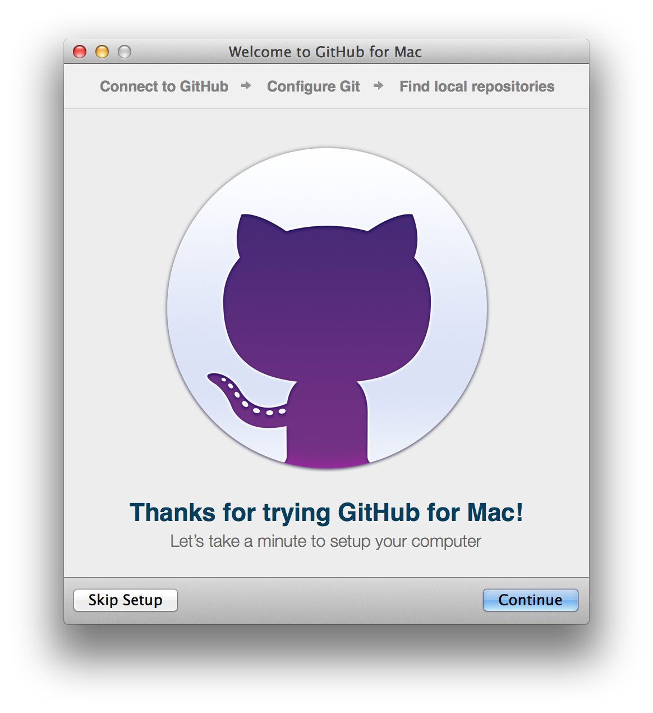
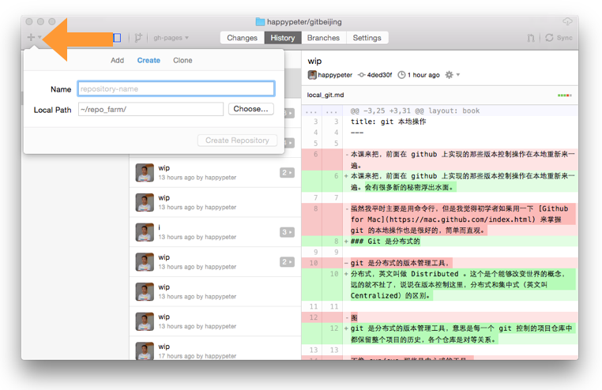

没有安装 git 并不妨碍我使用 github 的基本功能，同样，即使我不能联网，没有 github 账户，也可以在本地进行 git 的版本控制操作。
本课来把前面在 github 上实现的那些版本控制操作在本地重新来一遍。会有很多新的秘密浮出水面。虽然是本地操作，依然不需要自己安装 git，今天的主角是 Github 公司制作的客户端，我下面用 Mac 版的演示，但是 Windows 客户端，[Github for Windows](https://windows.github.com/)，的操作也是类似的。

### 登录

先说说什么是 git 。git 是一套命令行工具，有下面这些“子命令”组成。

虽然最常用的只不过是其中很小的一部分，但是要学会命令行中使用 git 还是有一定难度的，所以命令行操作咱们往后放一放。今天一起来用图形化的客户端工具 [Github for Mac](https://mac.github.com/index.html)，它里面封装了 git，操作上更为美观。

这样可以掌握 git 的最核心的操作，满足基本日常使用也就够了。

和 Github For Mac 客户端的安装跟其他 Mac 下的软件没有区别，很简单，不说了。不过咱们这样，同样的版本控制的基本操作，现在用客户端做一遍，这样对比一下前面用 github 网站时候的那些操作，相信会很有意思。

### 添加仓库

往 Github For Mac 客户端，后面简称客户端吧，里面添加仓库有三种方式。点击上图箭头所指的 `+` 号，就可以看到了，也就是下面图中的 `Add`，`Create`，`Clone` 这三种形式。

可以说这三种形式主要是被添加的仓库来源不同。先说第一种 `Add`，来源是你本地机器上已经存在的项目，填写它的文件夹位置，然后点击 `Create&Add Repository`，意思是如果这个项目本身就是一个 git 仓库了，就直接添加进来，如果不是就把它变成一个 git 仓库（其实也就是在项目内创建一个 .git 文件夹，这个回头讲命令行操作的时候再细说）然后再添加进客户端。

第二种，就是选择 create 这一项。顾名思义就是自己新建了。填写项目名，这里就叫 GUI 吧，然后选择项目存放位置，然后 Create Repository 那个按钮点一下，仓库就创建好了。这个操作似曾相识，是吧，只不过这次是在本地机器上创建的。

第三项，就是从 Github.com 上往本地 clone 。前面我已经用自己的 github 账号登陆的客户端了，所这里就会自动导入 github 上我自己的，或者是一些跟我相关的项目进来，选中一个，在本地找一个位置存放起来就好了。

补充一句。要删除一个仓库，就到左侧列表的项目名字上，右击，然后点 `Remove` 就行了。

### 基本版本控制
第二步，编辑项目。这个就用自己最喜欢的编辑器，我用 sublime，打开 GUI 这个项目，创建一个 README 文件吧，里面随便写点内容就行。

第三步，commit。 commit 英文的基本意思是执行某个重要的事情，例如 commit suicide，自我了断。但是在 git 这里，做动词讲的时候就是“保存版本”，当名词讲就是版本。所以这一步里也就是真正保存一个版本了，这个就关键了。

GUI 项目中有了 README 文件后，到项目的 `changes` 一项下面，就可以看到：

首先图中1和2两处可以看到目前项目修改了什么内容。

所以总结起来，从一个 commit 到下一个 commit，也就是从历史上的一个节点到下一个节点，要经历的操作是下面四步：

所以再分别到 GUI 和 CLI 两个项目中重复一下上面的四步。这样到客户端的 history 一项下面，就可以看到历史线上已经有两个 commit 了，点开任意一个都可以看到4个w。版本号没有例外的都是40位，但是真正要用的时候取前几位就行，只要跟其他 commit 区分开就行，图中给出了前7位，已经是非常安全了。即使在一个超大型项目，历史成千上万，版本号冲突的概率也比被雷劈中两次要低很多了。

### 总结

这里只是最基本的版本控制操作，历史回滚等其他内容后面再讲。