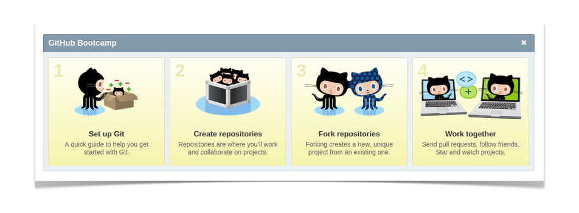
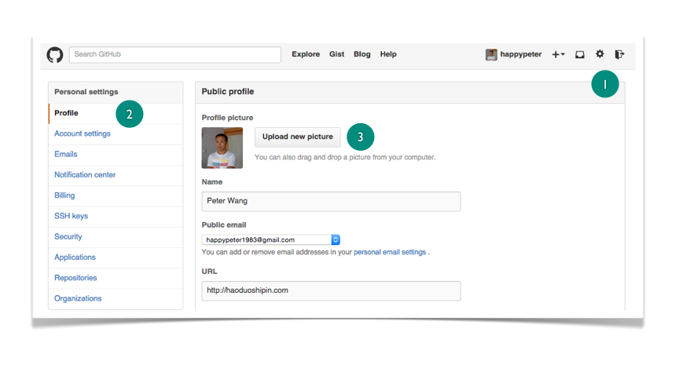
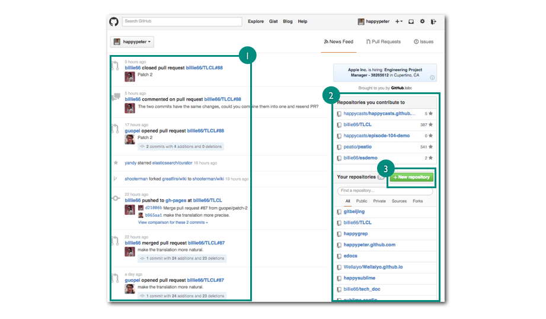
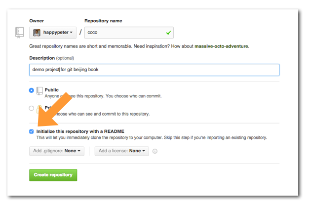
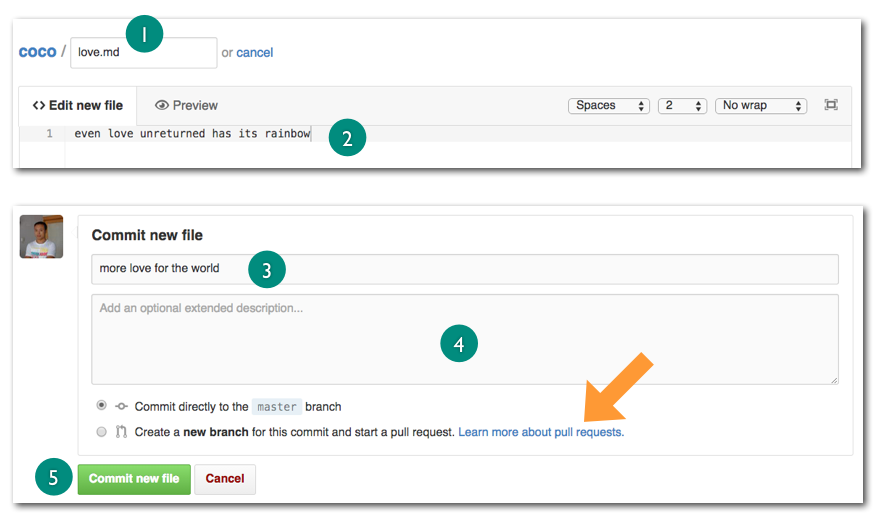
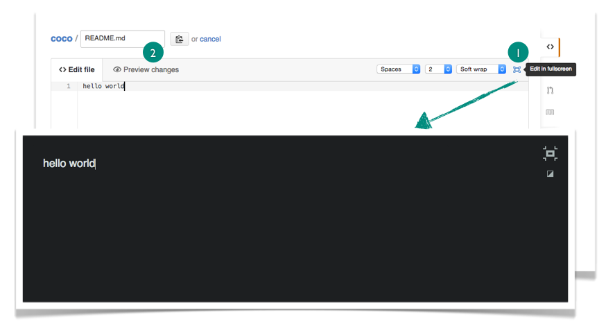
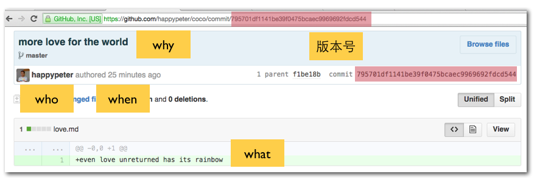
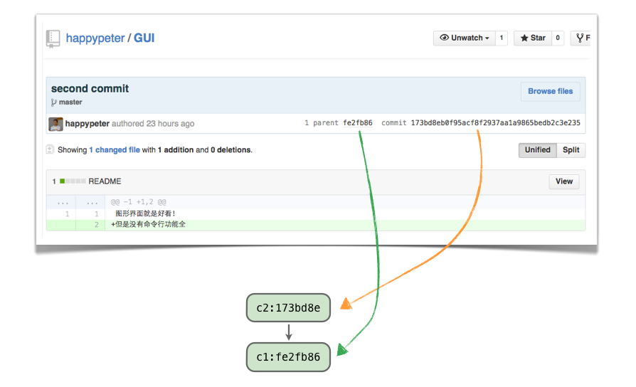
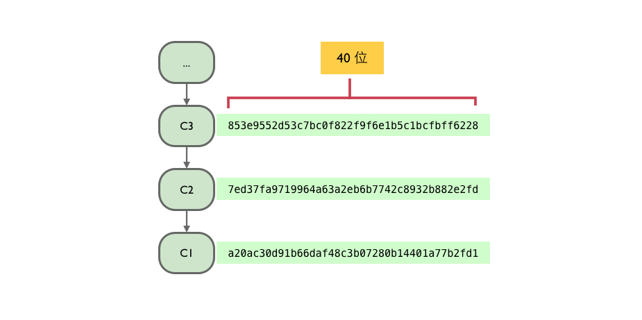

<!-- 还要多截图，很好看：http://happypeter.github.io/gitbeijing/github_in_browser.html -->

今天 Peter 来带你做一件曾经改变我生活的事情，就是注册并使用 github.com 。不会用 git ，就不能用 github 吗? 不是这样的。Github 的网站上通过网页操作就已经能实现很多强大的版本控制功能了，来一起看一看。

### 故事从注册开始

来到 <http://github.com> 的首页，就可以看到下面的注册界面：

填写自己的用户名邮箱，再设置一个妥妥的密码，点击 "Sign up for Github" 按钮，世界就属于你了。对于开源项目 github 是免费的，所以不用管付费相关的内容。接下来初次注册的用户会看到一共四步的 github 使用教程。

今天主要介绍第二步，其他几步回头另行介绍。所以这个四步走，稍微看一下，关了就行了。以后可以到 <http://help.github.com> 找到这些内容。另外你可能还会看到要求新用户去验证一下邮箱地址的提示，这个简单，到邮箱之中找到验证邮件，点一下里面的链接就可以了。

最后一步来给自己添加一个头像吧，github 是一个真正的交朋友的地方，每次你发评论或者写代码都是代表一个活生生的人格。

如上图，登录后的用户都可以在1处找到”设置“的图标，一个小齿轮，点一下，默认看到的就是2处的 `Profile` （个人信息），到3处选择图片上传就可以了。

### 创建项目仓库

Github 上操作虽多，但是都是围绕一个个的项目展开的。

一个项目其实就是一个文件夹，里面放着所有的项目文件，可以是代码，也可以是任意的文档。但是在 github 这里，每一个项目都不仅仅是最新版本的这些代码，还保持着所有的历史版本和修改记录，当然这个后台就是通过 Git 来实现的。Github 上的项目有一个新名称，叫 ”仓库“ ( repository )。说白了，一个仓库就是一个用 git 进行了版本控制的项目。

<!-- xxxxxxxxxxxxxxxx -->

点一下页面左上角的图标，就可以到达 dashboard ，控制面板，这个词本来的意思是汽车上的仪表板，日常所有的操作都在这里做。

比如左侧，图标“1”处，可以看到相关项目的最近更新，右侧，图标“2”处，是我自己的项目列表。现在我要创建一个项目，也就是点“3”处这个按钮。

这就到达了新建项目的页面：

注意这次要勾选 “Initialize this repository with a README” ，然后创建这个项目。也会看到 `Create Repository` 按钮的上方还有两个选择框，
一个是关于 .gitignore 的，后面会专门讲到，另一个是关于 LICENSE 的，选择开源授权协议。这两项如果选择了就是在项目中又多了两个文本文件，一个是 .gitignore 文件，另一个是 LICENSE 文件，暂时都不选就可以，回头需要了可以自己用编辑器新建。

### 编辑项目

创建项目完成后，就会跳转到 <https://github.com/happypeter/coco> 这个页面。这里的几乎每一个可以点的地方都会涉及到一个新概念，不用着急，后面咱们都会介绍到。先来瞄准一个最为重要的，叫 commit，如图中所指：

每次项目修改后，点击 "commit" 按钮就可以生成一个新的版本。commit 英文的基本意思是执行某个重要的事情，例如 commit suicide，自我了断。但是在 git 这里，做动词讲的时候是保存版本，当名词讲就是版本。

现在就来编辑一下。点击上面图中，项目名 “coco” 右侧的加号，进入下面界面。

来新建一个文件叫 love.md，标号1。填写文件内容，标号2。下面 `Commit new file` 部分填写的是“版本留言”（ commit message ），说明一下为什么要做这次修改。标号3处填写一个一行的留言，标号4处可以写详细留言，这一项是可选的。
最后，点击 `Commit new file` 按钮，一个新版本就做好了。

顺便提一下，github 的页面编辑器是经过特殊强化的，用起来非常舒服。点下图1处，可以进入全屏模式，编辑后还可以用2处的 `Preview changes` 预览一下修改内容。

自动跳转回项目页面之后，会发现原来 `1 commit` 的地方，现在已经变成了下图所示的 `2 commits`

`2 commits` 是个链接，点进入就进入了项目历史的页面。

现在看到历史上有两个版本，点开上面的一个版本，或者说一个 commit，就可以看到一个 commit 所包含的信息了。

最重要的是 `版本号` 或者叫 commit id 。每个 commit 都有一个，是一个40位16进制数，可以用来定位每个版本。注意一下地址栏中 url 的格式，以后只要是拿到了一个 commit 的 id 就可以查看这次的修改的详细内容了。

一个版本中最核心的内容就是这4个 `w` 了，谁（ who ）在什么时间（ when ）改了那些内容（ what ），最后一个是为什么要改（ why ），这个是版本留言发挥的作用，方便大家了解你的意图。

### 一条历史线

所有版本（ commit ) 组成了一条历史线。那么这条线是怎么串起来的呢？随便打开一个项目，打开具体一个 commit，通常会看到下图的内容：

上面显示了这个 commit 的 id ，但是同时还显示了它之前的一个 commit 的 id，这个就是它的 parent。底层是这样，一个 commit 内部是保存了它的 parent 的版本号的，这样就把它和它的爹连在了一起，爹还有自己的爹，就会形成下图的一条历史线。

有些版本工具是以 1，2，3... 作为版本号的，但是 git 这里每个版本号都是哈希值，40位十六进制数。

### 总结

Github 的功能还有很多，本节中只是介绍了最为核心的版本控制功能的一部分，后面对其他重要的功能还会有详细的介绍。
