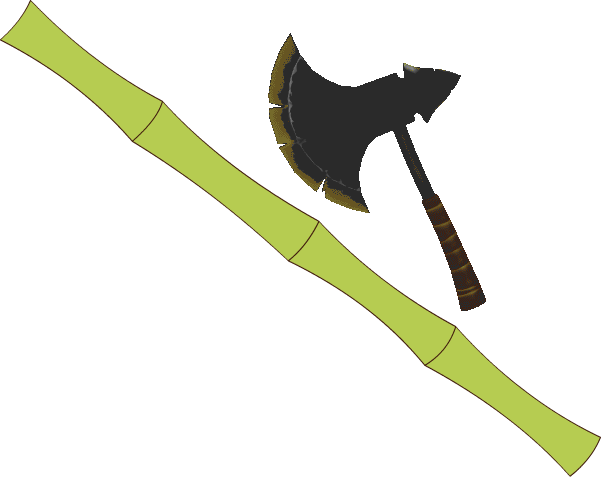

<!-- 除了 revert，这些操作是 githubformac 中没有的，所以要放到所有的 githubformac 中的功能都讲完了之后再将这一集。 -->

<!-- - small commit plz http://happycasts.net/episodes/92 -->

### throw/throwh

在一个 git 仓库中，修改的内容大概分为两类。一类是改完了还没有 commit 的内容，另一类是已经 commit 的了。


$ git reset --hard HEAD^


<!-- http://happycasts.net/episodes/59 08:30 有图解 -->

在我的 .gitconfig 文件中又这样的别名设置


[alias]
  throw = reset --hard HEAD
  throwh = reset --hard HEAD^


throwh 就是砍去一节竹子。当然砍去的肯定没用的 patch 。

throwh 操作对于未公开的仓库是非常好用的，但是一旦一个 commit 已经发布到了 github 之上了，大家都已经看到了并且有可能已经 pull 到了自己的本地仓库中，这样如果还是直接 throwh 了，将会给大家的后续操作带来很多麻烦。但是如果我就是脑子犯晕，把一些错误的修改直接 commit 并 push 到 github 之上了，这时候应该怎么办呢？解决方法是


$ git revert HEAD


用一个新的 commit 把前面那个错误的 commit 中的内容给覆盖掉。也不一定非得是最新的 commit，任何一个都可以


$ git revert (commit_id)


### 回到过去再回来

git checkout commit-id 这些操作最适合配图来讲，可以是 keynote 图，也可以是竹子
opl;

  - 对于没有跟踪的文件和文件夹，要 clean -f http://git-scm.com/book/en/v2/Git-Tools-Stashing-and-Cleaning#_git_stashing