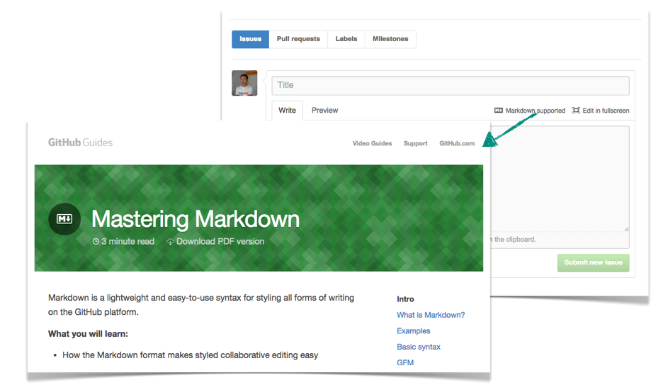
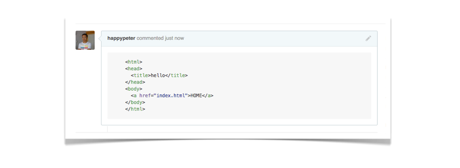

Github 上的每个项目仓库，都有三套基础设置可供使用：一个是通过 Github Pages 机制建立项目网站，后面会介绍的。另外一个就是每个项目都可以开自己的 wiki ，作为项目的知识库存。第三个就是咱们今天的主角，事务卡片（ Issues ）。很多比较复杂的项目管理软件会把“报 Bug ”，“提新需求”，“其他讨论”，这些项目相关的内容分成不同的板块来进行，在 Github 这里，所有的内容就都作为事务卡片来统一管理了。


<!-- 对于很多英文不好的同学，即使写明的内容也是坑，例如上传图片。我还是细心的介绍一下吧，给出英文的解释 -->

### 基本使用
到项目主页，例如 http://github.com/happypeter/coco 页面上，如何来提一个 Issue 呢？


上面图中，点击项目主页右侧的 `Issues` 链接，打开的页面中的大大的绿按钮就是新建 Issue 按钮，点一下就可以看到下图所示的界面


另外，对于开源项目，任何人都有权利提 Issue 的，有时候我有问题需要跟项目拥有者沟通，就可以提一个 Issue 。


### 支持 Markdown 语法

在新建 Issue 的界面上可以看到 `Markdown Supported` （支持 Markdown）的链接，点开，可以看到一篇详细的 Markdown 介绍文档。 



Markdown 是一种标记性语法，可以方便的写出格式美观的文档。下面来演示一下它的主要几个功能。

例如，可以像下面这样在你的 Markdown 文件里为 Ruby 代码添加语法高亮：


    ```html
    <!DOCTYPE html>
    <html>
    <head>
      <title>hello</title>
    </head>
    <body>
      <a href="index.html">HOME</a>
    </body>
    </html>
    ```

效果如下：



### 小技巧

还有几个小技巧也非常的能提高工作效率。

- 快速引用

- v2 的 progit 对 github 的讲解是非常详细的，甚至包括了 markdown 在 issue 中怎么写
  - http://git-scm.com/book/en/v2/GitHub-Contributing-to-a-Project
        
https://guides.github.com/features/mastering-markdown

https://guides.github.com/features/issues/


github 官方称自己是 ` best way to build and ship software` 可见 github 提供的可不仅仅是代码托管。

http://www.worldhello.net/gotgithub/04-work-with-others/050-issue.html#issue


Issue 的中文意思就要比较重要的事，比如自己发现了一个 Bug，或者有一个新功能的想法，以及任何需要跟团队公开讨论的事情都可以来提一个 issue 。
对于开源项目，外人也开参与进来发评论和创建新 issue 。这个比传统的项目管理软件，把 bug report，feature request，discussion 都分开来方便多了，
如果你在一个大一点的传统企业工作过，就知道有多少时间会浪费在学习这些狗屁流程上。而在 github 这里，简约带来效率。


### 讨论中添加 patch

### 

- 自动指向其他 issue
- markdown 支持

how github use github to build github

http://happycasts.net/episodes/47

A PR == A Issue

Issue 的最终命运是要被关闭的，真正精华的内容可以总结到 wiki 中。
