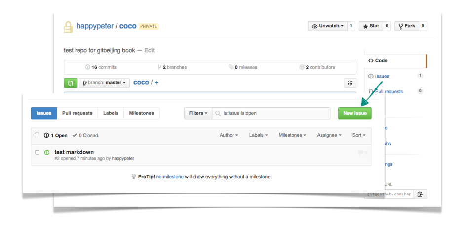
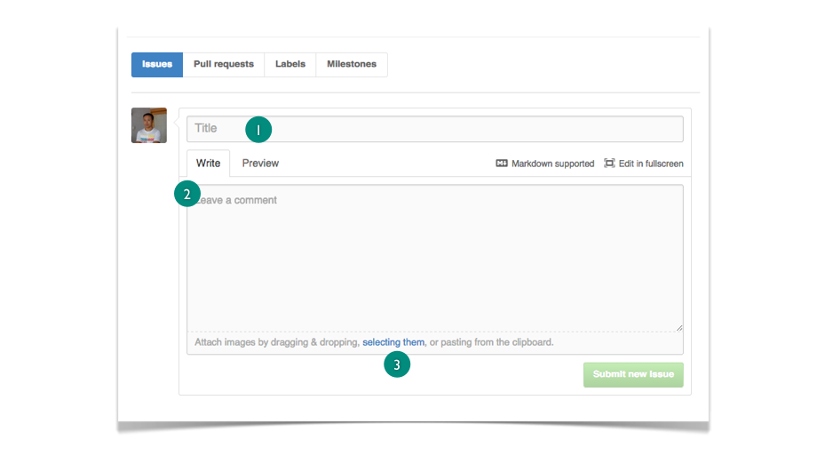

Github 上的每个项目仓库，都有三套基础设置可供使用：一个是通过 Github Pages 机制建立项目网站，后面会介绍的。另外一个就是每个项目都可以开自己的 wiki ，作为项目的知识库。第三个就是咱们今天的主角，事务卡片（ Issues ）。很多比较复杂的项目管理软件会把“报 Bug ”，“提新需求”，“其他讨论”，这些项目相关的内容分成不同的板块来进行，在 Github 这里，所有的内容就都作为事务卡片来统一管理了。

### 基本使用
比较详细的 Issues 功能介绍，可以参考[官方的 Issue 指南](https://guides.github.com/features/issues/)，今天咱们这里会捡着一些重要的来说。在 [How Github Use Github To Build Github](http://gitbeijing.com/talk/how-github-use-github-to-build-github/) 这个演讲中有 Issues 的使用哲学的一些讨论，非常有启发性的。

到项目主页，例如 http://github.com/happypeter/coco 页面上，如何来提一个 Issue 呢？



上面图中，点击项目主页右侧的 `Issues` 链接，打开的页面中的大大的绿按钮就是新建 Issue 按钮，点一下就可以看到下图所示的界面



如上图，是一个简单到不能再简单的页面，但是很多时候简单的确意味着更加的灵活和强大。1处添加标题，2处详细描述一下，要加图片？点一下3处的链接就行了。

另外，对于开源项目，任何人都有权利提 Issue 的，有时候我有问题需要跟项目拥有者沟通，就可以提一个 Issue 。

### 支持 Markdown 语法

在新建 Issue 的界面上可以看到 `Markdown Supported` （支持 Markdown）的链接，点开，可以看到一篇详细的 Markdown 介绍文档。


Markdown 是一种标记性语言，通过很简单的标注就可以表示出文本的格式，这样在评论框中写 markdown ，点发布评论按钮就可以转换成美观的 html 来显示了。下面来演示一下它的主要几个功能 。

可以用 `# text` 来把 `text` 变成一级标题，也就是 h1 格式。用 `**text**` 表示粗体。`*text*` 表示斜体。

引用内容用 `>` 打头就可以了，如下

    > 失败只有一种就是半途而废。

无序列表用

    * 第一项
    * 第二项
    * 第三项

也可以来插入代码块，支持语法高亮。例如，可以像下面这样为 Ruby 代码添加语法高亮：


    ```html
    <!DOCTYPE html>
    <html>
    <head>
      <title>hello</title>
    </head>
    <body>
      <a href="index.html">HOME</a>
    </body>
    </html>
    ```

发布后显示效果如下：


另外也可以插入图片和链接等其他格式。

### Issue 中的一些其他小技巧

还有几个小技巧也非常的能提高工作效率。

<!-- 视频中我可以通过一个流程把下面的技巧一下子带出来 -->

第一个，快速引用。Issue 这里是没有 reply 按钮的，如果你想回答具体某个问题，可以用鼠标选中那段话，然后，敲 r 。
这样这段话就自动出现在你的评论框中了。

第二个，拉别人进来讨论。如果你在评论框中输入 `@happypeter` 那么不管我是不是你当然项目的参与者，我都会收到通知来进来参加讨论。实际中发现这个用的是非常的多。

第三个，用版本留言关闭 Issue。如果有人给我的项目提了个 Bug，在一个编号为20的 Issue （后面简写为 Issue#20） 里。那我写几行代码修复这个 Bug 之后，在客户端作版本时，只要在版本留言里面写 `fix #20` 这样的字样，这个版本同步到 Github 上之后，这个 Issue#20 就自动关闭了。

第四个，如果我在当前 Issue#10 的评论框中写 `#20` 就可以自动链接到 Issue#20 了。同时 Issue#20 那边也会显示出 Issue#10 。这种指向和关联的功能在实用中是非常重要的。

另外，Issue 上也可以添加标签，设置 milestone，并且把任务布置给一个特定的开发者。

### 总结
前面咱们用过很多 Pull Request 的功能了，其实一个 PR 和一个 Issue 在很多方面都是一样的，所以 Issue 这里介绍的大部分功能都可以在 PR 讨论中使用。另外，Issue 中一般是放一些临时性的讨论，最终是要被关掉的。如果 Issue 里面有一些精华的内容，可以拷贝出来贴到 wiki 中，方便大家查阅。
