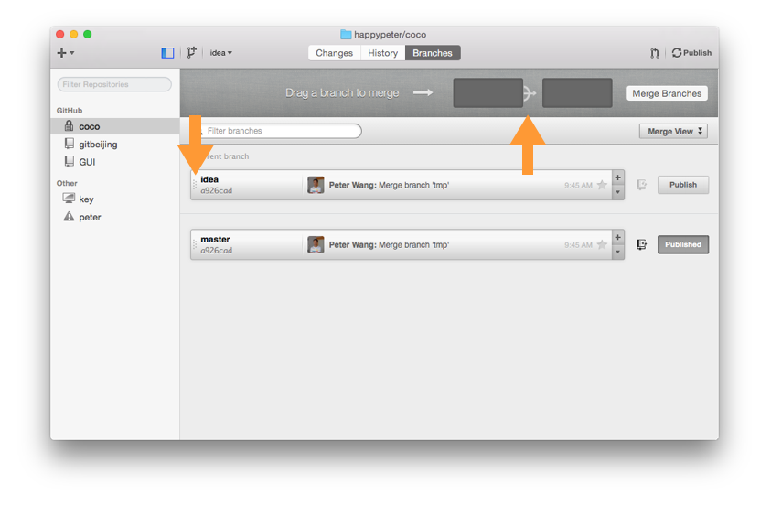
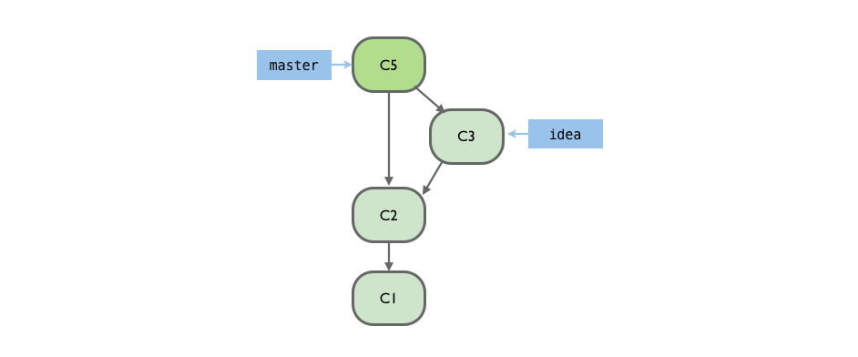
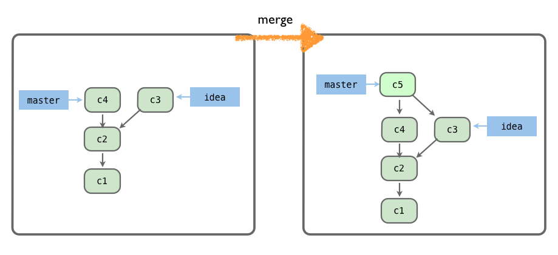
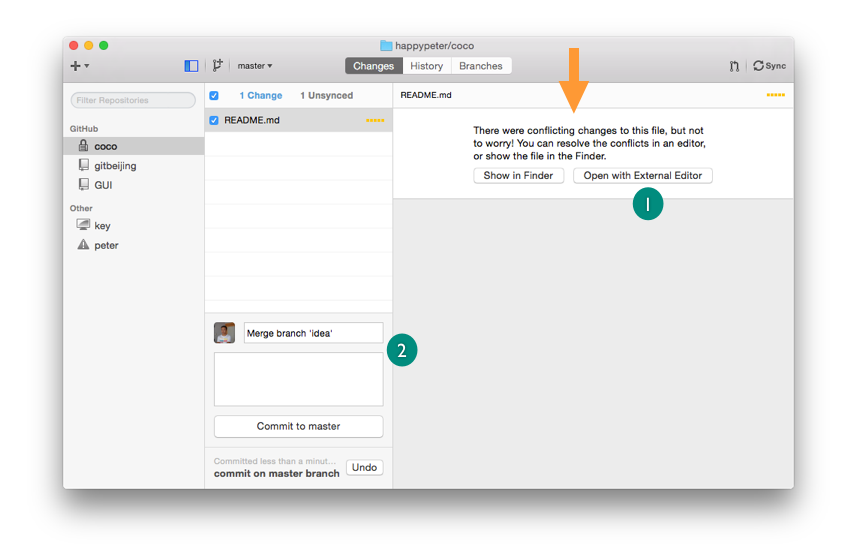

新的一天开始。比如昨天我在一个 idea 分支上实现了一个想法，今天我想把这些代码放回 master 分支，这就涉及到了两个分支合并的技巧。今天找几种实际情形，看看合并分支都有那些应用。

### 本地两个分支合并

先从最简单的一种情况着手。现在项目只有一个 master 分支，我来新建一个 idea 分支，实现自己的想法，commit 一下。那现在仓库内的情况就是这样的

这个是前面已经见过的情形了。那如何让 idea 的代码并入 master 呢？需要”融合“（ merge ）一下。到客户端的 Branches 一项下，点击 `Merge View`

现在我想要把 idea 分支 merge 进 master 分支，注意图中的箭头方向。把鼠标移动到 master 分支的最左侧部分，知道鼠标变成了小手，拖拽 master 分支到右侧空框框里，idea 拖到左侧。

然后点 `Merge Branches` 按钮。就合并成功了，master 中拥有了 idea 中的所有代码。底层历史变成了这样

新生成了一个 `C5` ，这是一个“融合版本”（ Merge Commit ）这个合并挺特殊，里面一般没有修改内容，它的作用主要是吧两个分支合并起来。怎么合并的呢？把 master 的内容 sync 到 github.com 上，然后查看一下这个 merge commit ，会发现它有两个 parent 。

merge 之后， master 分支指针指向了 merge commit，也就自动拥有了 idea 分支上的 `C3` 这个版本了。idea 分支一般这会儿就可以删除了。

### 代码冲突 conflicts

实际中经常有这样的情况，我正在 idea 分支上开发一个比较大的功能。但是这个时候突然发现了一个紧急的问题需要修复，所以我会直接到 master 分支上，做一个 commit 来解决这个紧急的问题。然后会来继续到 idea 上开发。

其他的情形也有，总之这样就会出现，两个不同分支上并行开发，同时都有新的 commit ，这个一般没有问题，一样可以直接 merge ，如下图

但是如果在两个分支上改动了同一个地方，合并的就会出现代码冲突。 因为 git 不知道该听哪个分支的，所以只能报出冲突的位置，让开发者手动解决。

来具体操作一下。在 idea 分支上，改动 README 文件中的一行，比如改成 `AAA`，commit 了，然后切换到 master 分支上，把这一行的内容改为 `BBB` ，也一样做 commit。这样再到客户端，打开 merge view 把 idea 分支 merge 到 master 之中，操作不会直接成功，而是会看到下面的代码冲突界面。

点击上图中的 `Open In External Editor` 按钮，就可以在你的编辑器中中打开存在冲突的文件，看到如下内容


test project for gitbeijing book
<<<<<<< HEAD
BBB
=======
AAA
>>>>>>> idea


注意上面的 `HEAD` 是代表当前分支，此刻对应我的情形就是 master 。所以 `=====` 就是两个冲突代码块的分界线了。上面的代码就是 master 分支上的，下面的代码是 idea 分支的。解决冲突就是把上面的三行“冲突标示符”都删掉，然后修改代码。之后，回到客户端，点击 2 处的 `Commit to Master` 。 这样，这次分支合并就完成了，也会生成一个 merge commit 。

合并分支除了融合（ merge ）还有另外一种形式叫”变基“（ rebase ）这里暂时用不上，先不管。

### 合并远端分支

现在我本地仓库叫 coco，github.com 上托管了这个仓库。那么自然就有本地一个 master 分支，和远端一个 master 分支，这两个分支虽然名字都叫 master，但是本质上也是两个分支，也存在分支合并的问题。

比如这样，我在 github.com 网页上，修改一下项目，把修改内容 commit 到 master 分支之上。这样，远端的 master 就比我本地的 master 分支多了一个 commit。此时我到客户端，点 sync 按钮执行同步，这样这个 commit 就会直接被拉（ pull ）到我本地，这个是前面提过的。

另外一种情况，在我没有 sync 之前，我自己在本地也做了一个 commit，也就是本地的 master 和远端 master 出现了并行开发的情况，这种情况是非常常见的。这个时候我执行 sync ，会发生什么呢？

来操作一下。我自己到 github.com 上面，打开 coco 项目，添加一个文件进来，叫 remote。然后到本地也添加一个文件叫 local，做一个 commit 。这样我执行 sync，跟本地两个分支合并是一样的，一般也会生成一个 merge commit，在本地客户端和 github.com 上的历史线都可以看到。

在特定条件下，点 sync 按钮两个分支合并会不使用融合（ merge ）方式，而采用“变基”（ rebase ）方式，这样最终不会生成一个 merge commit 。但是达成的效果是一样的，也是实现了两个分支代码的合并，处理冲突的方式也一样，所以暂时不必深究。

### 总结
前面学会了怎么开分支，今天又学会了怎么合并分支，那分支的基本操作就会了。后面就是在实际开发情形中运用了。
