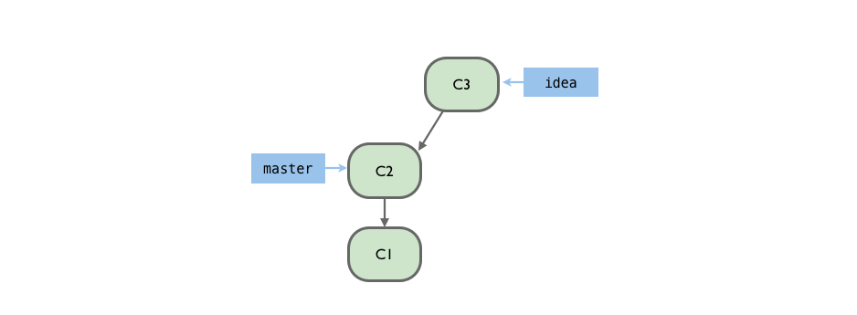
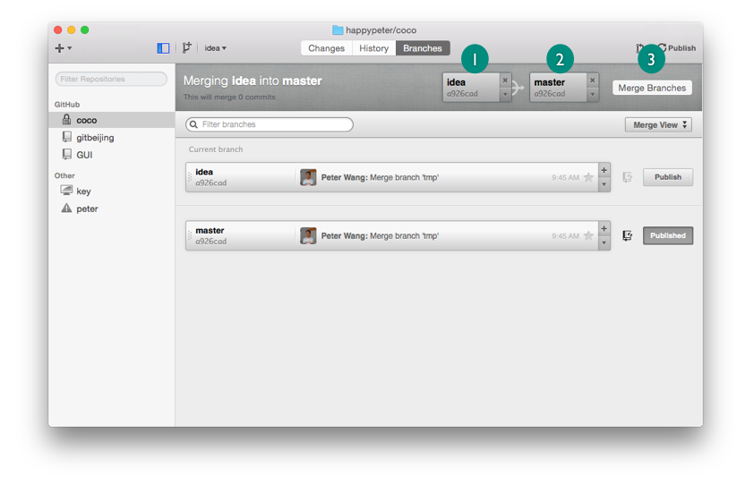

<!-- 合并分支有两种主要形式， merge 和 rebase ，下面结合实际操作，说说这二者的区别。 -->

<!-- https://help.github.com/articles/merging-branches/ -->

<!-- 先讨论两个本地分支合并，再聊本地和远端分支的合并，同时都用 merge 和 rebase 两种方式 -->

新的一天开始。比如昨天我在一个 idea 分支上实现了一个想法，今天我想把这些代码放回 master 分支，这就涉及到了两个分支合并的技巧。今天找几种实际情形，看看合并分支都有那些应用。

### 本地两个分支合并

先从最简单的一种情况着手。现在项目只有一个 master 分支，我来新建一个 idea 分支，实现自己的想法，commit 一下。那现在仓库内的情况就是这样的

这个是前面已经见过的情形了。那如何让 idea 的代码并入 master 呢？需要 merge 一下。到客户端的 Branches 一项下，点击 `Merge View`

现在我想要把 idea 分支 merge 进 master 分支，注意图中的箭头方向。把鼠标移动到 master 分支的最左侧部分，知道鼠标变成了小手，拖拽 master 分支到右侧空框框里，idea 拖到左侧。

然后点 `Merge Branches` 按钮。就合并成功了，master 中拥有了 idea 中的所有代码。底层历史变成了这样

新生成了一个 Merge Commit 这个 commit 挺特殊，里面一般没有修改内容，它的作用主要是吧两个分支连接起来。怎么连接的呢？把 master 的内容 sync 到 github.com 上，然后查看一下这个 Merge Commit 会发现它有两个 parent 。

merge 完之后， master 分支指针指向了 merge Commit，也就自动拥有了 idea 分支上的 `c3` 这个版本了。idea 分支一般这会儿就可以删除了。

### 代码冲突 conflicts

实际中经常有这样的情况，我正在 idea 分支上开发一个比较大的功能。但是这个时候突然发现了一个紧急的问题需要修复，所以我会直接到 master 分支上，修改做一个 commit，来解决这个紧急的问题。然后会来继续到 idea 上开发。

这样就会出现，master 和 idea 分支上同时都有新的 commit 的情况，这个一般没有问题，一样可以直接 merge ，如下图

并行开发是常见的事情，如果我和我同事在两个分支上做并行的开发，有的时候会两个人改动了同一个地方，这个时候就会出现代码冲突。

不管是用 merge 还是 rebase，都可能会出现“代码冲突”，如果你在两个分支中改动了同一个地方，并且改的不一致，合并的时候就会有冲突。
运行 `git status` 就可以看到到底都有哪些文件中发生了冲突

也有时候有这种情况，你和你同事同时发现了代码的一个问题，他先按照自己的想法改了一下，然后做出 commit，推送到了 github.com 之上。于此同时你本地也对同一个地方做了修改，但是改的内容不同。这个时候，远端 master 和本地 master 对于同一处代码各执一词，那 git 是没有办法解决这个问题的，只能靠人来解决，要人工解决代码冲突（ conflicts ）。

打开存在冲突的文件，看到如下内容


<<<<<<< HEAD:index.html

contact : email.support@github.com

=======

 please contact us at support@github.com

>>>>>>> iss53:index.html


注意上面的 `HEAD` 是代表你自己的当前分支。

<!-- 

使用 客户端 会 merge no-ff 不存在 fast-forward  的情况，这个跟 github.com 网站上是一样的。

-->

一种叫 merge 一种叫 rebase 。这部分我先图示一下这二者的区别。后面的几部分是实际使用。

### 合并远端分支

涉及到一个操作，就是拽回远端仓库的修改。

sync 按钮执行的操作相当于


$ git pull --rebase


同样都叫 master 分支，但是本地的 master 和 远程的 master 也是两个分支

<!-- 如果操作中绕不开了，就给大家引入 tracking branch 的概念 -->

运行 `git pull` 的时候如果自己本地也有修改，那么最好是用 `git pull --rebase`，这个在 git 牵手 github 那一章已经提到了，这里解释一下原因。


$ git config --global pull.rebase true


把远端仓库的 master 和本地 mater 合并，也是两个分支的合并，同时是非常常见的一种情形。

如果不小心用 git pull 下了远端的内容，也没有关系，可以使用 `git push --force` 来进行 push 

https://octicons.github.com/ 上面还有专门一个 icon 叫 force-push 。

