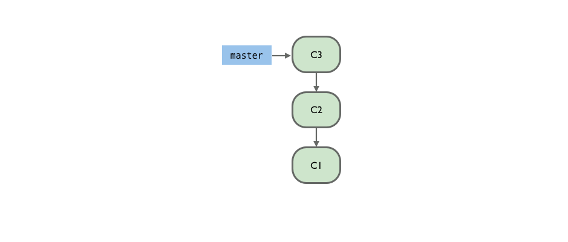
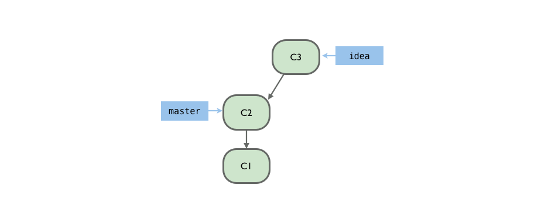

今天的主角是分支，因为不介绍分支（ branch ）的概念，下面的操作是没办法介绍了。可以这样说，Git 最核心的操作对象是 commit 版本，最核心的操作技巧就是分支。

<!-- https://help.github.com/articles/branching-out/ -->

### 什么是分支？

<!-- head 的概念就先别提了  master 是指针也不用讲，就说新分支是原来分支的一个拷贝就够用了

但是不给出指针的概念，历史线就不能用真图了，那后面 merge 怎么讲？

 -->

仓库创建后，一旦有了新 commit，默认就会放到一个分支上，名字叫 master。前面咱们一直看到的多个版本组成的一条历史线，就是 master 分支。但是一个仓库内，用户可以自己创建其他的分支，可以有多条历史线。

说说 master 这个名字，一般中文叫“主分支”，其实从技术底层来讲它跟其他我们自己要创建的分支没有区别，只不过它是天生默认分支。实际工程项目中，一般会在 master 分支上存放稳定代码。就像 github 和其他很多公司[倡导](https://guides.github.com/introduction/flow/index.html)的 

> Master is always deployable.

意思就是 master 分支上的代码，应该是比较成熟的，随时可以放到产品服务器上跑的代码。这样，如果想开发一个新功能，可以新开分支。 想象一下历史线上又很多节，一个分支相当于一跟竹子，一节节的往上长。每个版本就是一节。

但是实际上 master 本身只是一个指针，指向 master 分支上最新的一个版本。

### 创建新分支

比如我在 master 分支上正在干活，但是忽然有个新想法要试一下，这个时候我就可以开一个新分支了，到客户端的 `Branches` 这一项

图

`Create a new branch off master` 就是来创建一个 `idea` 分支，这个分支从使用的角度就是 master 分支的一个拷贝，拥有跟 master 分支一样的当前项目代码，以及所有改版历史。其实在底层这个的实现是非常巧妙的，就是又创建一个新的 idea 分支，同时跟 master 指向同一个版本。所以根本不用拷贝历史线。

就创建了一个名字叫 idea 的指针。到 Github for Mac 客户端里看一下，发现确实多了一个分支。

上图箭头中的小对号表示当前已经切换到了 idea 这个分支之上，那 idea 就叫做当前分支。 

如果现在我对项目做一下修改，然后 commit 了。那么移动的只是 idea 指针，master 不变。就成了这样：

所以现在 master 分支包含两个版本 C1 和 C2，idea 分支包含三个版本 C1，C2，C3 。

默认情况下这个 idea 分支只是存在于本地，如果想在远端仓库上发布这个分支，就点一下 publish 按钮

图

这样，到远端仓库看一下，发现果然多了一个 idea 分支

图

### 切换分支
到 branches 标签下，相中哪个分支了，双击一下就切换过去了。时间长了你会觉得这个也不够快，还是纯键盘操作快。敲 Cmd-B 可以打开分支切换框，输入名字回车，就切换成功了。

如果你在 idea 分支上有了修改但是还没有来得及 commit，这时候如果切换分支，那么 git 会替你保存这部分修改，也就是在切换到的分支上是看不到这部分修改的。但是不要担心，只要你切换会老分支，修改又回来了。

注意，每次切换分支，项目代码，术语叫 Working Tree 是会随着变化的，在 Sublime 中看看就知道了。

<!-- https://help.github.com/articles/why-did-my-changes-disappear-when-switching-branches/ -->

在远端仓库，也就是 github.com 上如何切换默认分支呢？到 settings->branch 这一项修改就可以了。

### 删除分支

首先当前分支是不能删除的。什么意思？到客户端的 `Branches` 标签下，左侧有对勾的就是当前分支，打开右侧小箭头的下拉菜单，可以看到 `delete` 这一项是禁用的。想删除它，就先要切换到其他分支，例如 `master` 。再去删除成功了，同时 github.com 上的远端仓库上 tmp 分支也同时被删除了。

再来新建一个 idea 分支，并且把它 publish 到 github.com 。在客户端把分支切换到 idea，现在试图去删除 master 。点开 master 分支的小箭头，发现 `delete` 一项可以点，所以点一下，但是报错了：“"master" is the repository's default branch and cannot be deleted.` 所以现在就要到 github.com 上修改默认分支。就像上一步介绍的那样。

如果只想删除远端分支，保留本地分支，可以使用 `Unpublish` 这个选项。

<!-- 如果本地分支有没有 commit 的修改，能 delete 分支吗？ -->

### 总结

只开测试分支，调好代码 commit 了之后，如果不把代码搞到 master 分支上是没有太大意义的，这就涉及到分支合并的问题了，这个是 git 最大最强的一块功能，后面再介绍。