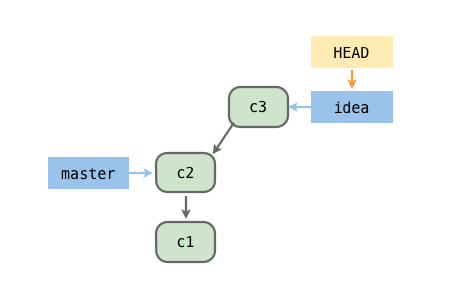
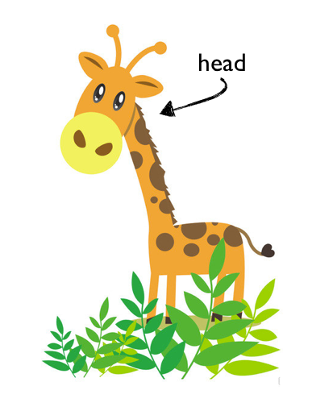

今天的主角是分支，因为不介绍分支 branch 的概念，下面的操作是没办法介绍了。今天来介绍如何创建新分支，并在分支间进行切换。

<!-- https://help.github.com/articles/why-did-my-changes-disappear-when-switching-branches/ -->

https://help.github.com/articles/branching-out/

https://help.github.com/articles/merging-branches/

### 什么是分支？

<!-- head 的概念就先别提了  master 是指针也不用讲，就说新分支是原来分支的一个拷贝就够用了 -->

默认仓库创建的时候就是一个分支，名字叫 master，但是用户可以自己创建其他的分支的。

说说 master 这个名字，一般中文叫“主分支”，其实从技术底层来讲它跟其他我们自己要创建的分支没有区别。只不过它是天生默认分支。实际工程项目中，一般会在 master 分支上存放稳定代码。就像 github 和其他很多公司[倡导](https://guides.github.com/introduction/flow/index.html)的 

> Master is always deployable.

意思就是 master 分支上的代码，就是产品服务器上正在跑的代码。如果想开发一个新功能，可以自己新开一个分支。具体怎么操作先放放，先把分支的基本原理说一下。

想象一下历史线上又很多节，每一节就是一次再版，好像一根竹子。 一个分支相当于一跟竹子，一节节的往上长。每个版本就是一节。

所以，虽然本质上每次新创建一个 git 的分支，其实就是创建了一个新的包含分支名字的指针。但是从用户的角度来看，每一个分支就相当于一根独立的竹子了。非常巧妙。而在很多传统版本控制工具那里，每次你开一个新分支，就会真的把当前整个项目拷贝一份出来，会很慢。

### 创建新分支

比如我在 master 分支上正在干活，但是忽然有个新想法要试一下，这个时候我就可以开一个新分支了，到客户端的 `Branches` 这一项

图

`Create a new branch off master` 就是来创建一个 `idea` 分支，这个分支从使用的角度就是 master 分支的一个拷贝，拥有跟 master 分支一样的当前项目代码，以及所有改版历史。其实在底层这个的实现是非常巧妙的，并不是通过直接拷贝 master 实现的，后面讨论命令行使用的时候，在对分支的底层原理做[深度介绍](branch.html)。 

新分支上做任何修改都不会影响到 master 分支。

就创建了一个名字叫 idea 的指针。到 Github for Mac 客户端里看一下，发现确实多了一个分支。

上图箭头中的小对号表示当前已经切换到了 idea 这个分支之上，那 idea 就叫做当前分支。 达成的效果如下图：

就会看到当前分支已经是 idea 了。因为 idea 和 master 都指向相同的地方，所以此刻，这两个分支是相同的。有意思的是，如果新建分支上面继续做开发，新添加一个 commit，就是下面这样的情况

注意这个时候 master 分支是没有动的。要想切换回 master 分支


$ git checkout master


这样，HEAD 指针就又指向了 master 。

HEAD 永远指向当前分支的最新的版本。
<!-- stash 的报错情况很不好描述，用到得又不是挺多，所以偷懒不讲了 -->

如果 idea 的代码我想要引入 master，那就涉及到合并分支了，后面会作详细介绍。否则，删除分支就要


$ git branch -D idea


注意，被删除的分支不能是当前分支。

### 切换分支

如果你在 idea 分支上有了修改但是还没有来得及 commit，这时候如果切换分支，那么 git 会替你保存这部分修改，也就是在切换到的分支上是看不到这部分修改的。但是不要担心，只要你切换会老分支，修改又回来了。

注意，每次切换分支，项目代码，术语叫 Working Tree 是会随着变化的，在 Sublime 中看看就知道了。

<!-- https://help.github.com/articles/why-did-my-changes-disappear-when-switching-branches/ -->

在远端仓库，也就是 github.com 上如何切换默认分支呢？到 settings->branch 这一项修改就可以了。

### 删除分支

首先当前分支是不能删除的。什么意思？到客户端的 `Branches` 标签下，左侧有对勾的就是当前分支，打开右侧小箭头的下拉菜单，可以看到 `delete` 这一项是禁用的。想删除它，就先要切换到其他分支，例如 `master` 。再去删除成功了，同时 github.com 上的远端仓库上 tmp 分支也同时被删除了。

再来新建一个 idea 分支，并且把它 publish 到 github.com 。在客户端把分支切换到 idea，现在试图去删除 master 。点开 master 分支的小箭头，发现 `delete` 一项可以点，所以点一下，但是报错了：“"master" is the repository's default branch and cannot be deleted.` 所以现在就要到 github.com 上修改默认分支。就像上一步介绍的那样。

如果只想删除远端分支，保留本地分支，可以使用 `Unpublish` 这个选项。

<!-- 如果本地分支有没有 commit 的修改，能 delete 分支吗？ -->

### 总结

只开测试分支，调好代码 commit 了之后，如果不把代码搞到 master 分支上是没有太大意义的，这就涉及到分支合并的问题了，这个是 git 最大最强的一块功能，后面再介绍。