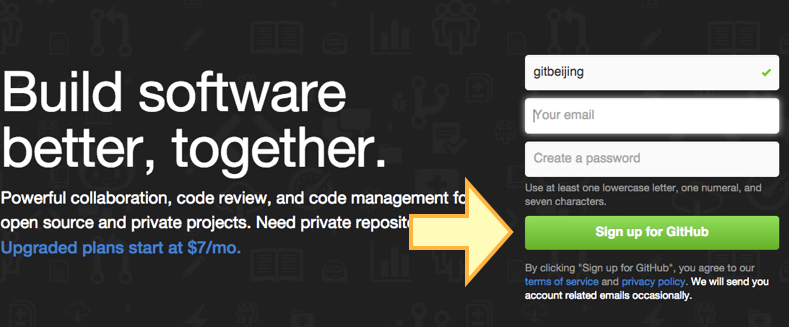

- github-init http://happycasts.net/episodes/7
  - ssh key 和其他一些内容本级中就不解释了，后面用到 git push 的时候，push 失败了再引入会更好
  - 命令行操作也要尽量避免

# 不会 git 也可以用 Github 

没有命令行，不会用 git 就不能用 github 吗? NO! github 的网页界面就已经能实现很多强大的功能了，来一起看一看。

### 故事从注册开始

来到 <http://github.com> 的首页，就可以看到下面的注册界面：

填写自己的用户名邮箱，再设置一个妥妥的密码，点击 "Sign up for Github" 按钮，世界就属于你了。对于开源项目 github 是免费的，所以不用管付费相关的内容。

添加头像。github 这里头像很重要，为什么？因为文化，这里是一个崇尚个人品牌的地方，一个创作的地方。

### 创建项目
一个项目其实就是一个文件夹，里面放着所有的代码，但是在 git 这里，就有一个新名称了，叫 ”仓库“ ( repo )，一个仓库就是一个项目文件夹，只不过这个文件夹是用 git 进行了版本控制的，可以看到所有的修改历史，点击 history 按钮。

### 编辑项目

每次项目修改后，点击 "commit" 就可以生成一个新的版本。commit 这个词有时候当动词就是”记录当前的版本“，当名词时候可以粗略的认为它就代表一个版本。每个 commit 都有一个 commit 号，可以用来定位每个版本，例如 <https://github.com/happycasts/happycasts.github.com/commit/2727fd13f6> 。

每次修改的内容叫做一个 patch，
后面再聊 git 本地操作的时候，会涉及到相同的这些概念。

网页界面这里也能给别人的项目进行贡献，这个是通过 Pull Request 来实现的，这个后面要细聊，这里先过了。

更多内容可以参考 <http://git-scm.com/book/en/v2/GitHub-Contributing-to-a-Project> 。

这样 https://help.github.com 这里的四步走的前两步就都介绍了，下面两步会在后面的视频中介绍。